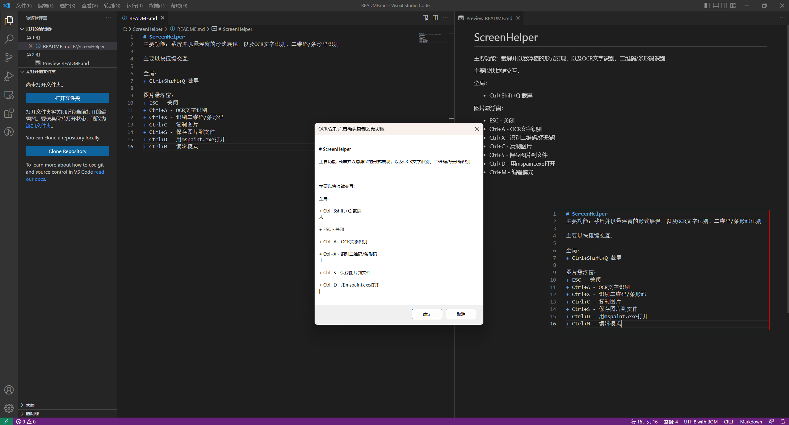

# ScreenHelper

主要功能：截屏并以悬浮窗的形式展现，以及OCR文字识别、二维码/条形码识别

主要以快捷键交互：

全局：
+ Ctrl+Shift+Q 截屏

图片悬浮窗：
+ ESC - 关闭
+ 双击 - 切换是否置顶
+ Ctrl+A - OCR文字识别
+ Ctrl+Q - 识别二维码/条形码
+ Ctrl+C - 复制图片
+ Ctrl+X - 复制图片并关闭悬浮窗（剪切）
+ Ctrl+S - 保存图片到文件
+ Ctrl+鼠标滚轮 - 放大/缩小
+ Ctrl+D - 用mspaint.exe打开
+ Ctrl+M - 编辑模式

